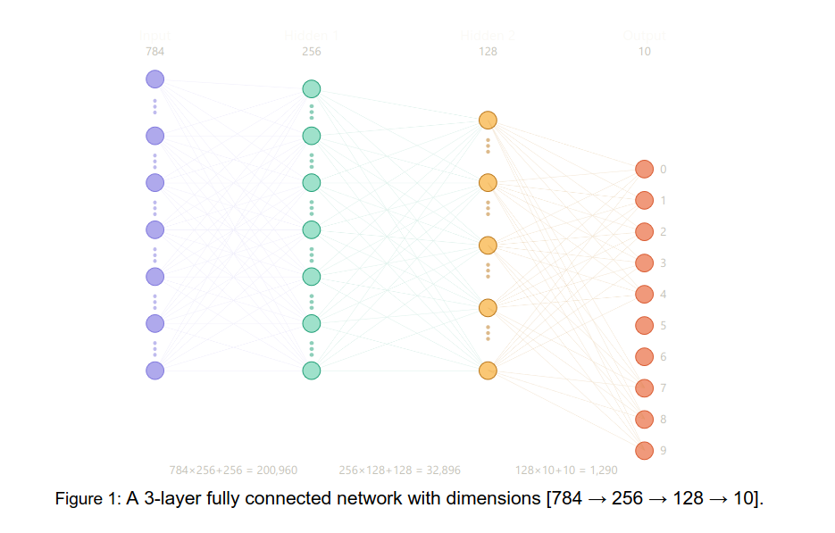

# CMAN for Codefest #1
You are given a 3-layer fully connected network with dimensions [784 → 256 → 128 → 10], batch size 1,
all weights and activations in FP32 (4 bytes each). No bias terms. 

**Tasks**
1) For each layer, compute the number of multiply-accumulate operations (MACs). Show the formula and the substituted values.\\

    The number of MACs for a particular layer is given by the multiplying the inputs `I` with the outputs `0`. For the network provided below we get the following:
    1) Layer 1: $$784 \times 256 = 200{,}704$$
    2) Layer 2: $$256 \times 128 = 32{,}768$$ 
    3) Layer 3: $$128 \times 10 = 1{,}280$$ 

2) Sum the MACs across all three layers to get the total MACs for one forward pass.

    The sum of the total MACs for the three layers is given by summing the MACs for each individual layer, which for our network is given by the following:  
        

        $$\text{MAC}_{\text{tot}} = 200{,}704 + 32{,}768 + 1{,}280 = 234{,}752$$
        

        
3) Compute the total number of trainable parameters (weights only, no biases).

    Since there are no bias terms, the total number of trainable parameters are the total number of weights. In other words, the total number of trainable parameters is the same as the total number of MACs. Lets call the number of trainable parameters $T$  
        

        $$T = 234{,}752$$
        

4) Compute the total weight memory in bytes (FP32).

    Each weight needs to be stored somewhere, so if each weight has 32-bit memory for its storage then the total weight memory is calculated by multiplying the total weights (calculated above) times the memroy required per weight (in our case 32-bits). Since we want to know the memory in bytes, and we know that 32-bits is 4-bytes, we can instead multiply the number of weights by the number of bytes required per weight. Let $$W_{text{tot}}$$ denote the total weight memory.
    

    $$W_{\text{tot}} = (234{,}752)(4 \text{bytes}) = 939{,}008 \text{bytes}$$
    

5) Compute the total activation memory in bytes needed to store the input and all layer outputs simultaneously (FP32).

    To obtain the activation memory we need to sum all the inputs plus all the layer outputs and multiply the totla by each value's memory. Let $A_M$ be the activation memory, and $O_n$ be the number of outputs at the nth layer. Also let $I$ be the number of inputs.

$$
\begin{align*}
    A_M &= (I + O_1 + O_2 + O_3)(4 \text{ bytes})\\
        &= (784 + 256 + 128 + 10)(4 \text{ bytes})\\
        &= (1{,}178)(4 \text{ bytes})\\
        &= 4{,}712 \text{ bytes}
\end{align*}
$$
    

6) Compute arithmetic intensity as: (2 × total MACs) / (weight bytes + activation bytes).

    Let the arithmetic intensity be denoted by $A_{int}$, then

    $$
        \begin{align*}
        A_{int}  &=  (2 \times \text{MAC}_{\text{tot}}) / (W_{text{tot}} + A_M)\\
                 &=  (2 \times 234{,}752) / (939{,}008 + 4{,}712)\\
                 &=  0.498\\
        \end{align*}
    $$

