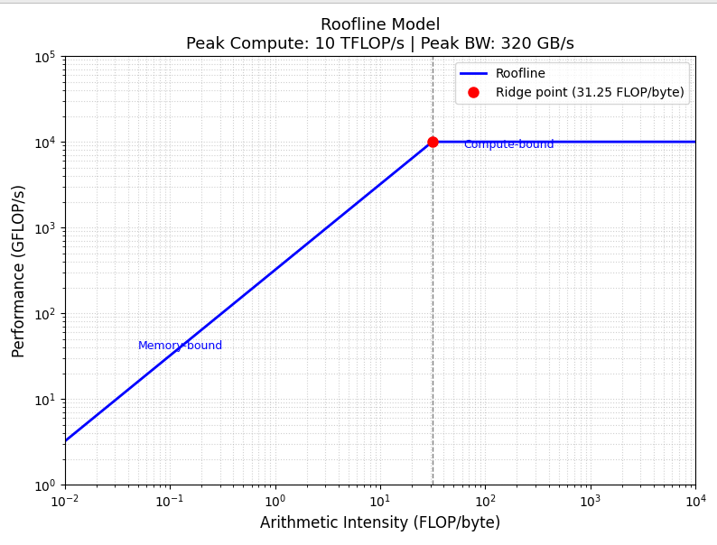
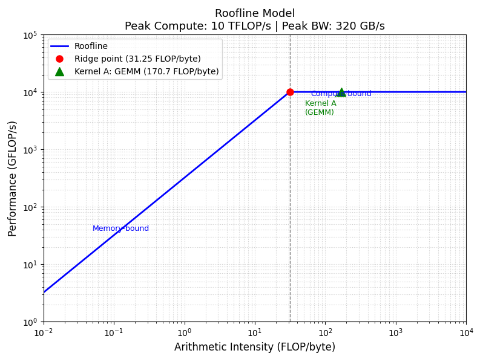
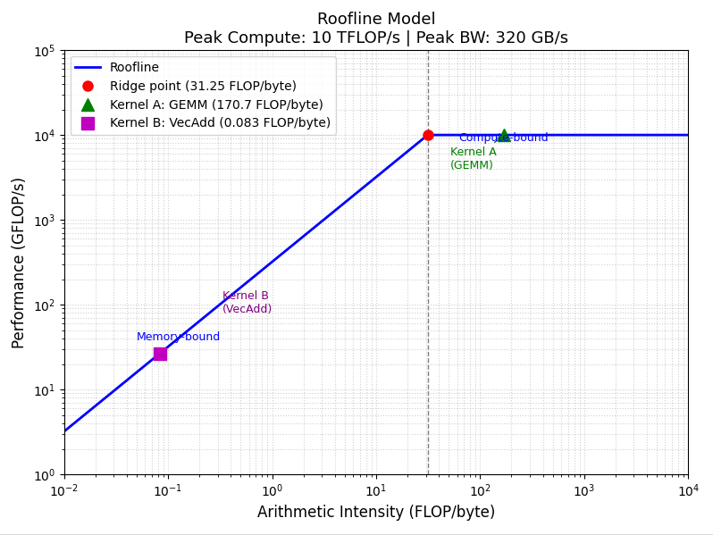

# Codefest #2
Use the following hardware specification: peak compute = 10 TFLOPS (FP32), peak DRAM bandwidth = 320 GB/s, ridge point = 10,000/320 ≈ 31.25 FLOP/byte.

1) On log-log axes (x: FLOP/byte, y: GFLOP/s), draw the roofline: the diagonal bandwidth-limited segment and the flat compute-limited ceiling. Label the ridge point coordinates.

2) Kernel A — Dense GEMM: two FP32 matrices of size 1024×1024 multiplied together. Compute FLOPs (2×N³ for square matmul), bytes transferred assuming all three matrices (A, B, C) are loaded/stored from DRAM with no cache reuse, arithmetic intensity, and plot the point on your roofline. 

    * **Number of FLOPs** : $$\text{FLOPs} = 2 \times N^3 = 2 \times (1024)^3 = 2.147 \text{ GFLOP}$$
    * **Bytes Transferred** : $$\text{Bytes} = 3 \times N^2 \times 4 \text{ Bytes} = 3 \times 1024^2 \times 4 = 12.58\text{MB}$$
    * **Arithmetic Intensity** : $$\text{AI} = \frac{\text{FLOPs}}{bytes transferred} = \frac{2.147\text{ GFLOP}}{12.58\text{MB}} = 170.7\frac{\text{FLOPs}}{\text{Bytes}}$$

    

3) Kernel B — Vector addition: two FP32 vectors of length 4,194,304 added element-wise. Compute FLOPs, bytes transferred, arithmetic intensity, and plot the point.

    * **Number of FLOPs** : The number of FLOPs is simply the length of the vector since we are only perfomrming $N = 4,194,304$ operations.
    

    $$\text{FLOPs} = 4.194 \text{ MFLOPs}$$
    

    * **Bytes Teansferred** : Since we have three vectors---data is read from the two vectors and data is written into the third vector, which means the number of bytes transferred is the number of FLOPS times three times the number of bytes in FP32.
    

    $$\text{Bytes Transferred} = 3 \times \text{N} \times 4 \text{ bytes} = 3 \times 4,194,304 \times 4 \text{ bytes} = 50.33 \text{ MB}$$
    

    * **Arithmetic Intensity** : $$ \text{AI} = \frac{4.194 \text{ MFLOPs}}{ 50.33\text{ MB}} = 0.0833 \frac{\text{FLOPs}}{\text{B}}$$

    

4) For each kernel, state: (a) memory-bound or compute-bound on this hardware; (b) attainable performance ceiling in GFLOP/s; (c) what architectural change would most improve performance.

    a) **Kernel A** is compute bound and **Kernel A** is memory bound.
    b) **Kernel A** has a performance ceiling of $10,000\text{ GFLOPS}$ since it is compute-bound and **Kernel B** has a performance ceiling of $$26.56 \text{GFLOPS}$$ 

