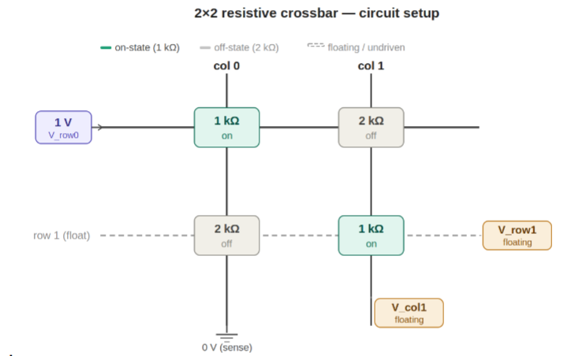

# CMAN Codefest 6

Consider the 2×2 resistive crossbar below. Rows carry input voltages; columns carry output currents. Cell
resistances are fixed: R[0][0] = 1 kΩ, R[0][1] = 2 kΩ, R[1][0] = 2 kΩ, R[1][1] = 1 kΩ. The low-resistance cells
(1 kΩ) encode “on” weights; the high-resistance cells (2 kΩ) encode “off” weights.

