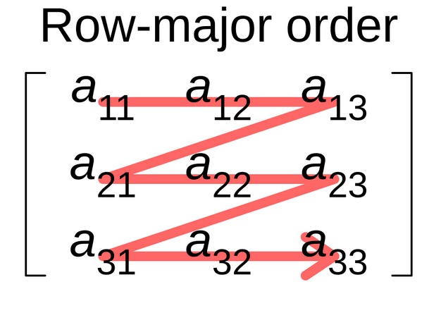
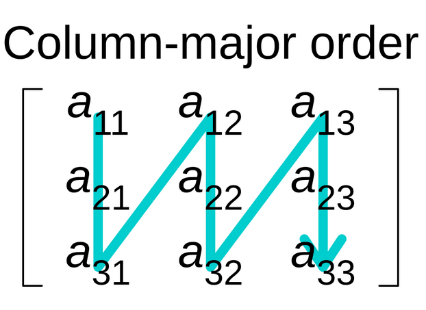
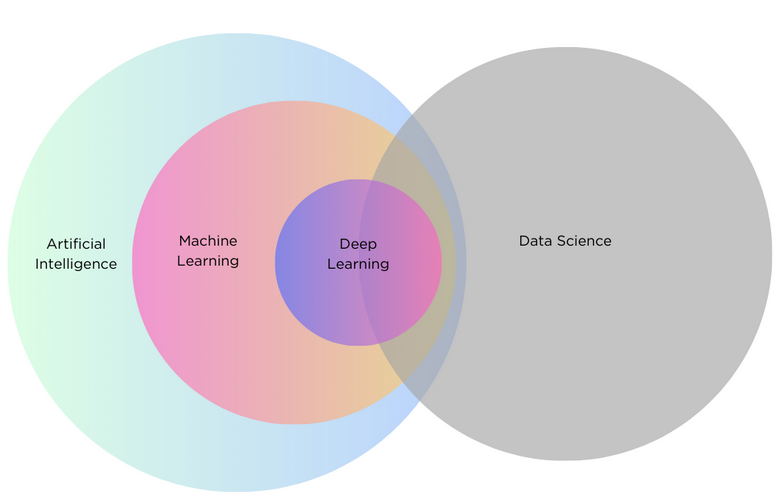
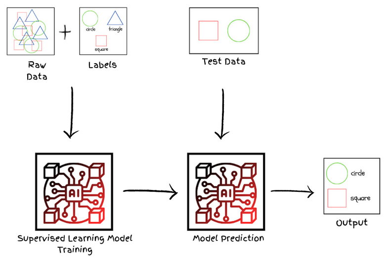
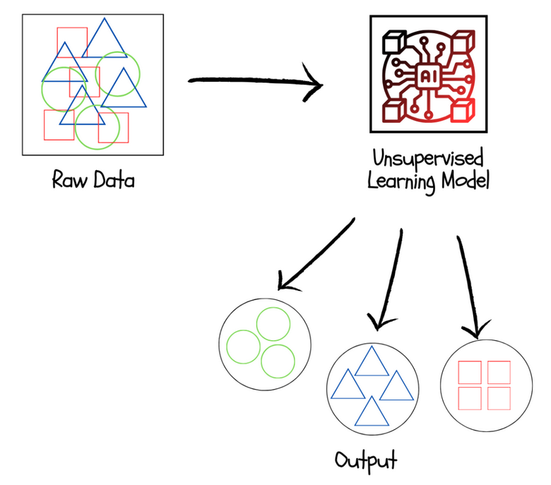
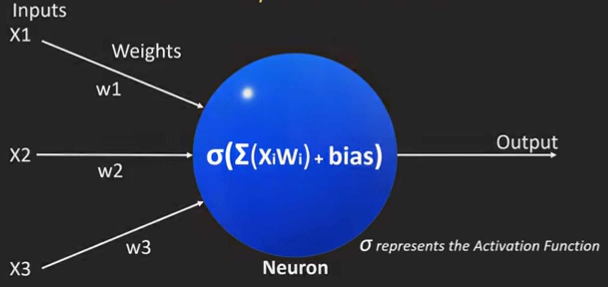

# Notes
Blah Blah

## Mutliply-Accumulate Operations (MACs)
This is one of the fundamental computational blocks of used to calculate weigted sums in neural networks.
 * It counts the mutlyply-add operations performed
 * FIXME

## Bytes Transferred in Neural Networks
The amount of data moved between memory (DRAM) and the processing unit (GPU/CPU/AI accelerator) during training or inference.

## Inference vs Training

## Intrinsic vs Designed Computation
* `Intrinsic`: The hardware itself finds the solution
    * Changing problem will require changing the hardware which makes it harder--less flexible
* `Designed`:Things like code that solve the problem
    * More flexible, meaming tweaking parameters is easier

## Why Design Something New?
* Data Locality: when we have off-chip memory there is high latency and requires high energy. It is better to have memroy on chip.
* Compute Closer to Physics: Blah

## What is a Computing Kernel?
In this context a compute kernel is a single computational routinethat runs on a processor (or GPU or some other HW)

## Arithmetic Intensity (AI)
Measures how much computation a program performs relative to how much data it moves
* $$I = \frac{\text{FLOPs}}{\text{bytes transferred}}
    * If $AI < 1$: moves more data than it computes
    * If $AI >1$: computation larger than the data movement
    * Unit is **FLOPs per byte** (FLOP/B)
* Used to characterize whether workload is bottlenecked by compute throughput or by memory badnwidth
    * A workload with **low AI** moves a lot of data relative to the work done
    * A workload with a **high AI** does a lot of computation per byte fetched

## General Matrix Multiply (GEMM)
Hello

## Kernel in Machine Learning
A kernel is a relatively straightforward function that operates on two vectors from the input space

## Convolutional Layer
Think of a convolutional layer as a filter being placed above an image

## Ridge Point
Optimal point were the memory-bandwith slope intersects the comput bound line

## Maximum Memory Bandwidth

## GPU
Used to parallelize.
Good for compute-intensive functions

### Single Instruction

## Tensor
It is a matrix with coordinates

### Tensor Cores
Operate on FP16 

## CUDA
Stands for Compute Unified Device Architecture. Is a parallel computing platform and programming model developed by NVIDIA.

## Warp
A warp is a group of threads that executes instructions simultaneously on a GPU 

## Row-Major Order
The **Row-Major Order** is a method of storing mutlidimensional arrays in linear storage such as RAM

## Column-Major Order
The **Column-Major Order** is a mehtod of storing multidimensional arrays in linear storage sucha as RAM

# Mahine Lerning Fundamentals
* **Artificial Intelligence**: Involves any technique or system that tries to mimic human intelligence. Includes machine learning and deep learning as specific approaches
* **Machine Learning**: ML is a subset of AI that focuses on developing algorithms that enable computers to learn from data
* **Deep Learning**: It's a specific type of ML that uses neural networks to learn complex patterns in data

<figcaption> Image from <a href="https://www.blog.trainindata.com/machine-lea**rning-fundamentals/">here</a></figcaption>
</figure>

### Types of ML Learning Algorithms
ML methodologies can be categorized into two main types: supervised learning and unsupervised learning.
* **Supervised Learning**: Supervised Learning involves training a model on labeled data where each input is associated with an output. The goal is to learn a mapping function from input variables  to output variables
    * `Regression`: Regression models predict continuous values. For example, predicting house prices based on features like square footage , number of bedrooms, and location is an example

    * `Classification`: Classification models predict discrete outcomes , or categories. For instance, classifying emails as spam or non-spam based on their content is an example.

* **Unsupervised Learning**: In usupervised learning the ML algorithm learns patterns and structures from unlabeled data. The algorithm seeks to discover hidden patterns or groupings within the data.
    * `Clustering`: Clustering algorithms group similar data points together into clusters. The goal is to identify natural groupings or clusters in the data without prior knowledge of their labels
    * `Dimentionality Reduction`: Dimensionality reduction techniques aim to reduce the number of features in a dataset while preserving its essential information
    * `Anomaly Detection`: Anomaly detection with unsupervised learning involves identifying unusual patterns or outliers in data without labeled examples. By analyzing the inherent structure and distribution of the data, unsupervised learning algorithms detect deviations or irregularities that stand out from the typical patterns, thus flagging potential anomalies.

### The Neural Network
A neural network is a ML model that stacks simple neurons in layers and learns pattern-recognizing weights and biases from data to map inputs to outputs.

* **Neuron**: A neuron is the is the most basic unit in a neural network. It's  single computational unit that:
    * **Recieves inputs**: `: either raw data or outputs from a previous layer
    * **Computes a weighted sum**: $$z =W_1X_1 + W_2X_2 + ... + W_nX_n + b$$
    * **Applies an activation function**: `output = activation(z)`
    * **Passes the output forward**: passes output to next layer 

NOTE: The **weights** (`W`) and **bias** (`b`) are what the model learns during training and the structure (how many neurons and how they connect) is what the engineer designs.

* **Types of Activation Functions**

| Function |	Formula	    | Use                            |
|----------|----------------|--------------------------------|
|ReLU      | `max(0, x)`    | 	Default for hidden layers    |
|Sigmoid   | `1 / (1 + e^-x)`	| Binary output                  |
|Softmax   |normalizes to probabilities | Multi-class output |
| Tanh	   | `(e^x - e^-x)/(e^x + e^-x)` |	RNNs             |
| GELU	   | smooth ReLU variant       | Transformers        | 

